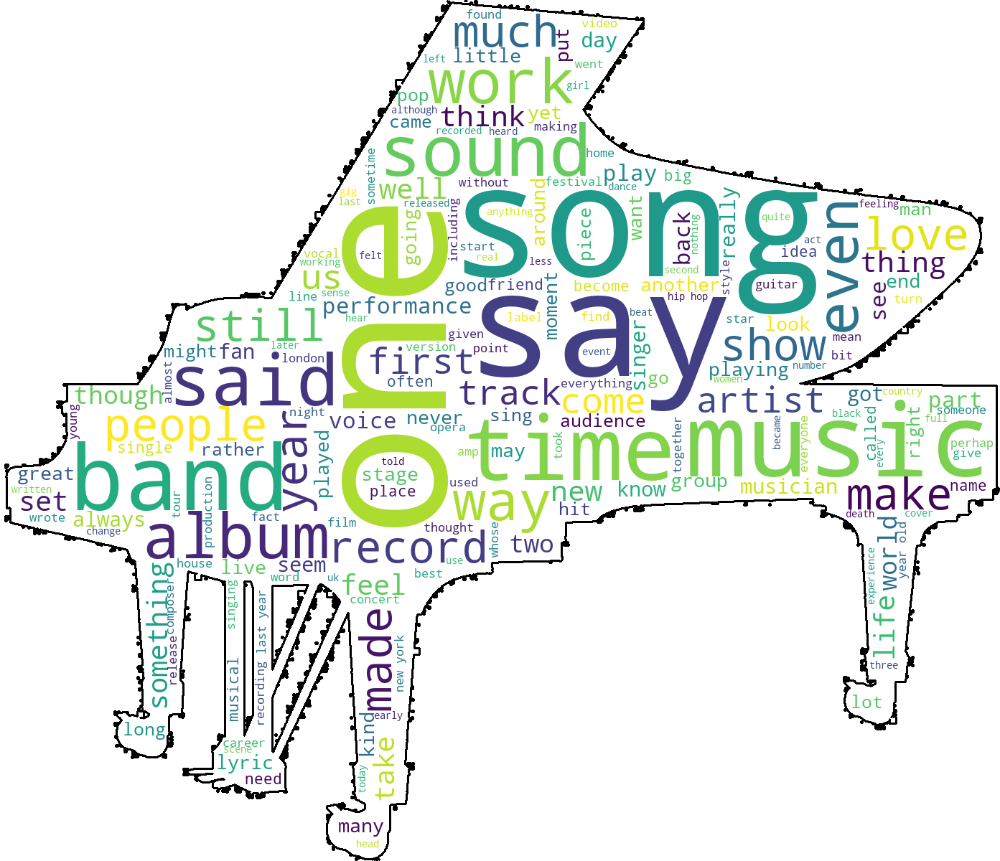

## Project Overview

The Guardian newspaper is looking to implement a system to automatically archive articles into their correct subject categories, saving journalists having to manually enter metadata when moving urgent copy.  

To do this, they have asked us to assess the viability of producing a model that will take in every news article published to its internal system and immediately tag it with one of its 24 subject category labels.  

If the model is successful, the newspaper will  provide further funding to improve the model and potentially market it to other news outlets.  

They have also asked us to present them any data picked up during the modelling process, which could provide insights into hidden trends and reporting standards.  

 
 

### Business Problem

To produce an accurate model that will automate the process of tagging news article with their correct classification label. The model will allow urgent copy to be sent quicker, and could potentially be marketed to other media outlets.  

The newspaper is interested in finding any hidden trends in each category and in articles that generate the most social media interest.  

 
 

### The Data

To generate the models, we used a dataset of every article stored in the Guardian's archives since 2013,  a total of 735,920. These articles were pre-tagged with their category filter and were accessed through the Guardian's free to use API.

 
 

### Methods

We trained various models using the text and category label of the articles. We also used different techniques for processing the words  and for representing them in the model. Unseen articles were fed into the models, and their performances evaluated and compared.  

We analyzed the workings of the best performing model to see which words were most important in deciding which category each article belonged in, potentially revealing hidden insights.  

 
 

### Headline Results
 

**The two best performing models, out of the 24 created, predicted the correct labels almost 80 percent of the time.**  
 
 

**The best-performing model struggled most with stories  in the world-news, business and lifestyle categories as these tend to be more loosely defined and overlap with other categories.**  
 
 

 
 

**The model's internal decision making process can analyzed to reveal which words are the most important in predicting category labels, whether across the whole corpus, each category or individual articles. providing potentially valuable hidden insights.**
 

 
 

### Conclusion

* The model is definitely accurate enough to suggest it could become a viable product, both internally and commercially, with more resources.

* It also generates useful insights, potentially revealing hidden threads that run through categories and generating story angles. It can also help in analysing reporting standards in our own copy.

### Next steps

* Provide funds for more storage space and processing power to enable the models to be better 'tuned' and to enable more advanced processing techniques on the article to help it discern between overlapping categories

* Channel more resources into analyzing the workings of the model to find hidden insights. The model can easily be linked to Twitter analytics, or to other metadata tags such as byline to glean distinctive features of successful writers or stories that play well on social media
 

 
 
